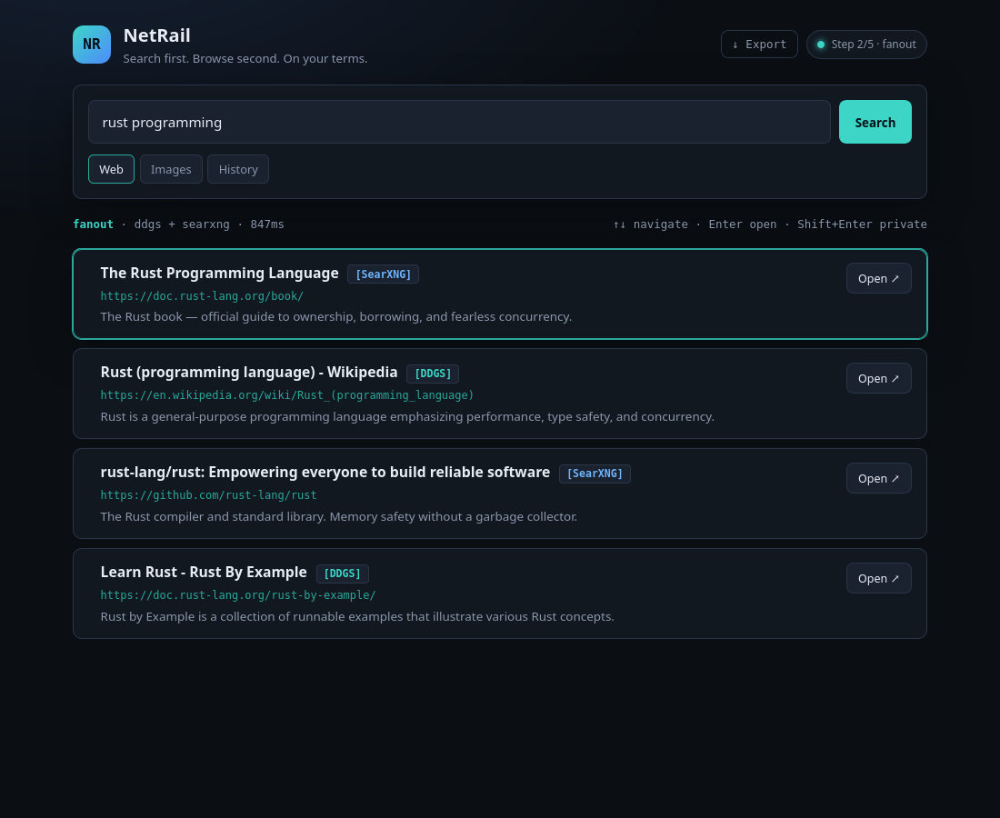

# NetRail

**Search first. Browse second. On your terms.**

## Install (Linux)

Download the **AppImage** or **.deb** from the [latest release](https://github.com/netrail/netrail/releases/latest).

```bash
# Desktop app (AppImage)
chmod +x NetRail_1.0.0_amd64.AppImage
# Ubuntu 24.04+ without FUSE: APPIMAGE_EXTRACT_AND_RUN=1 ./NetRail_1.0.0_amd64.AppImage
./NetRail_1.0.0_amd64.AppImage

# Or Debian/Ubuntu package
sudo dpkg -i NetRail_1.0.0_amd64.deb
```

**Headless API** (homelabs, scripting, Docker):

```bash
chmod +x netrail-api
./netrail-api --api-only
curl http://127.0.0.1:7421/api/health
```

Build from source: see [Development](#development) below.

---



*Fanout search across SearXNG and DDGS. Results stay in the link rail until you open them.*

**Version:** 1.0.0 · **License:** [AGPL-3.0](LICENSE) · **Manifesto:** [OPEN_LETTER.md](OPEN_LETTER.md)

---

## What is NetRail?

NetRail is a local, privacy-first research console for Linux. It fans out your query to every search backend you enable, merges results on your machine, and shows them in a **link rail** — nothing opens in a browser until you choose.

| Problem | NetRail answer |
|---------|----------------|
| Search is a funnel | Link rail — you choose what to open |
| One fragile index | **Fanout** to SearXNG + DDGS + Brave concurrently |
| Opaque provenance | `[DDGS]` / `[SearXNG]` / `[Brave]` pill on every result |
| Cloud history | Encrypted SQLite + FTS5, local only |
| Slow startup | Native Rust engine, **&lt;100ms** API cold start |
| Surveillance economics | Zero telemetry — audit the source |

**Binaries:** 12MB desktop · 6.7MB headless API · zero accounts · zero analytics.

---

## Sovereignty Steps

NetRail does not pretend you can overthrow Google overnight. It shows you exactly where results come from, and gives you a path to independence.

| Step | Level | What you get |
|------|-------|--------------|
| 1 | 🟡 **Default** | DDGS metasearch — disclosed chain: You → NetRail → DDG → Bing |
| 2 | 🟠 **Self-hosted** | Add your [SearXNG](https://docs.searxng.org/) instance (`searxng_url`) |
| 3 | 🟢 **Paid independence** | Bring your own Brave Search API key (`BRAVE_SEARCH_API_KEY`) |
| 4 | 🔜 **Owned corpus** | Local crawl & FTS5 index *(v2.x)* |

Every result shows a backend pill. Every query stays on `127.0.0.1`. Every setting lives in `~/.config/netrail/`.

---

## Threat Model & Encryption Boundaries

NetRail is built for local, single-user use. We are honest about what we protect and what we don't.

**What is encrypted at rest:**
- Search query text (via Fernet / OS keyring)
- Result titles and snippets

**What remains plaintext:**
- FTS5 search index (queries are tokenized for fast local search; encrypted blobs cannot be indexed by SQLite FTS5)
- Visited URLs and collection items (to allow re-opening and deduplication)

**Localhost API:** NetRail binds to `127.0.0.1` with no authentication. Any process on your machine can read/write the API. If you do not trust your local machine, NetRail cannot protect you.

If your threat model requires full-disk encryption or defense against local malware, use LUKS or FileVault. NetRail protects you from cloud surveillance, not from a rootkit.

---

## Fanout & backends

Enable backends in `~/.config/netrail/settings.json`:

```json
{
  "search_strategy": "fanout",
  "searxng_url": "http://127.0.0.1:8080",
  "brave_enabled": true,
  "backend_order": ["searxng", "ddgs", "brave"]
}
```

**Brave API key** — never stored on disk:

```bash
export BRAVE_SEARCH_API_KEY="your-key"
```

Set `search_strategy` to `"fallback"` for legacy sequential behavior.

---

## Keyboard workflow

Power users don't need a mouse.

| Key | Action |
|-----|--------|
| `↑` / `↓` | Highlight result in link rail |
| `Enter` | Open highlighted result |
| `Shift+Enter` | Open in private/incognito |
| `Ctrl+C` (search focused) | Copy highlighted URL |
| `Ctrl+Shift+S` (Tauri) | Focus NetRail from anywhere |

---

## Local API

All endpoints bind to `127.0.0.1:7421` only.

```bash
curl -s http://127.0.0.1:7421/api/health
curl -s -X POST http://127.0.0.1:7421/api/search \
  -H 'Content-Type: application/json' \
  -d '{"query":"rust programming","mode":"web","max_results":10}'
```

Full API: [docs/MANUAL.md](docs/MANUAL.md)

---

## Documentation

| Document | Description |
|----------|-------------|
| [User Manual](docs/MANUAL.md) | Search, operators, browsers, troubleshooting |
| [Architecture](docs/ARCHITECTURE.md) | Design, lifecycle roadmap |
| [Distribution](docs/DISTRIBUTION.md) | Flatpak, Docker, AppImage, install |
| [Open Letter](OPEN_LETTER.md) | Philosophy and the v1.0 postscript |
| [Release notes](docs/RELEASE_v1.0.0.md) | v1.0.0 launch copy (for GitHub Release) |

---

## Development

```bash
git clone https://github.com/netrail/netrail.git && cd NetRail

# Native desktop (Tauri)
npm install && npm run build
./src-tauri/target/release/netrail

# Headless API only
cargo build --release --manifest-path src-tauri/Cargo.toml \
  --bin netrail-api --no-default-features

# Python fallback + tests
python3 -m venv .venv && source .venv/bin/activate
pip install -r requirements.txt
pytest
```

---

## Project structure

```
NetRail/
├── src-tauri/          # Rust + Tauri (primary engine)
├── netrail/static/     # Web UI
├── netrail/            # Python headless fallback
├── .github/workflows/  # Release CI (AppImage + .deb + netrail-api)
└── docs/
```

---

## License

AGPL-3.0 — fork it, improve it, ship it.

---

*Built with spite and hope. For everyone who remembers when the web felt like yours.*