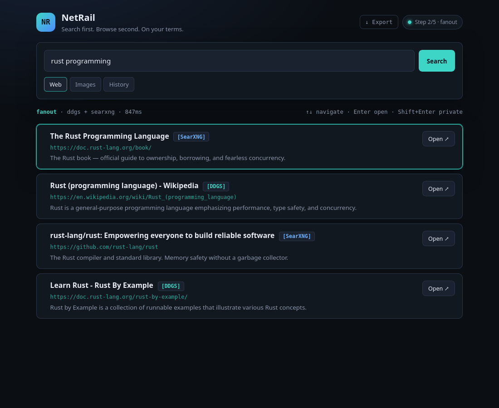

# NetRail

**Search first. Browse second. On your terms.**

## Install (Linux)

Download the **AppImage** (recommended) or **.deb** from the [latest release](https://github.com/kayab999/NetRail/releases/latest). Verify `SHA256SUMS` (and the cosign signature when present).

### Desktop (AppImage — double-click)

```bash
chmod +x NetRail_*_amd64.AppImage
# Ubuntu 24.04+ without FUSE:
APPIMAGE_EXTRACT_AND_RUN=1 ./NetRail_*_amd64.AppImage
```

Or install the Debian package:

```bash
sudo dpkg -i NetRail_*_amd64.deb
# then launch "NetRail" from the app menu, or: netrail
```

**System requirements (desktop):** modern 64-bit Linux (glibc, x86_64), a display server (Wayland or X11). The AppImage bundles the WebKit/GTK runtime pieces Tauri needs; you do **not** need to install Rust, Node, or Python to run a release build. On hosts without FUSE, keep `APPIMAGE_EXTRACT_AND_RUN=1`.

**User data (XDG, never inside the AppImage):**

| Path | Purpose |
|------|---------|
| `~/.config/netrail/settings.json` | Settings |
| `~/.local/share/netrail/netrail.db` | History / collections |
| `~/.local/share/netrail/audit.log` | Audit JSONL (only when `NETRAIL_AUDIT_LOG=1`; rotates up to 10 MiB × 3) |

**Logs:** NetRail writes no log file by default — run it from a terminal to see
stdout/stderr. `NETRAIL_LOG_JSON=1` switches Rust-stack logs to structured JSON on
stdout (`journalctl -u netrail-api` under systemd). Application errors also reach
the UI (`/api/health`).

**Uninstall:**

- **AppImage:** remove the file (it never writes outside XDG). Optionally delete
  user data: `rm -rf ~/.config/netrail ~/.local/share/netrail`.
- **.deb:** `sudo dpkg -r netrail`
- **.rpm:** `sudo rpm -e netrail`
- **systemd service (optional setup):** `sudo systemctl disable --now netrail-api`

### Headless API (homelabs, scripting, Docker)

```bash
chmod +x netrail-api
./netrail-api
curl http://127.0.0.1:7421/api/health
```

(`netrail-api` is always headless; `--api-only` is for the desktop `netrail` binary.)

**Build distributables from source:** `bash scripts/build-desktop-linux.sh` → artifacts in `dist/release/`. Full packaging notes: [packaging/README.md](packaging/README.md).

---



*Fanout search across SearXNG and DDGS. Results stay in the link rail until you open them.*

**Version:** 1.6.5 · **License:** [AGPL-3.0](LICENSE) · **Manifesto:** [OPEN_LETTER.md](OPEN_LETTER.md)

---

## What is NetRail?

NetRail is a local, privacy-first research console for Linux. It fans out your query to every search backend you enable, merges results on your machine, and shows them in a **link rail** — nothing opens in a browser until you choose.

| Problem | NetRail answer |
|---------|----------------|
| Search is a funnel | Link rail — you choose what to open |
| One fragile index | **Fanout** to SearXNG + DDGS + Brave concurrently |
| Opaque provenance | `[DDGS]` / `[SearXNG]` / `[Brave]` pill on every result |
| Cloud history | Encrypted SQLite + FTS5, local only |
| Slow startup | Native Rust engine (cold start depends on machine; not CI-gated) |
| Surveillance economics | Zero telemetry — audit the source |

**Binaries:** compact desktop + headless API (sizes vary by strip/link flags) · zero accounts · zero analytics.

---

## Sovereignty Steps

NetRail does not pretend you can overthrow Google overnight. It shows you exactly where results come from, and gives you a path to independence.

| Step | Level | What you get |
|------|-------|--------------|
| 1 | 🟡 **Default** | DDGS metasearch — disclosed chain: You → NetRail → DDG → Bing |
| 2 | 🟠 **Self-hosted** | Add your [SearXNG](https://docs.searxng.org/) instance (`searxng_url`) |
| 3 | 🟢 **Paid independence** | Bring your own Brave Search API key (`BRAVE_SEARCH_API_KEY`) |
| 4 | 🔜 **Owned corpus** | Local crawl & FTS5 index *(v2.x)* |

Every result shows a backend pill. The **API** listens only on `127.0.0.1`; search queries leave your machine only to backends you enable (and Wikipedia fallback when web fanout is empty). Settings live in `~/.config/netrail/`.

---

## Threat Model & Encryption Boundaries

NetRail is built for local, single-user use. We are honest about what we protect and what we don't.

**What is encrypted at rest:**
- Search query text (via Fernet / OS keyring)
- Result titles and snippets

**What remains plaintext:**
- FTS5 search index (queries are tokenized for fast local search; encrypted blobs cannot be indexed by SQLite FTS5)
- Visited URLs and collection items (to allow re-opening and deduplication)

**Localhost API:** NetRail binds to `127.0.0.1` with no authentication. Any process on your machine can read/write the API. If you do not trust your local machine, NetRail cannot protect you.

If your threat model requires full-disk encryption or defense against local malware, use LUKS or FileVault. NetRail protects you from cloud surveillance, not from a rootkit.

---

## Fanout & backends

Enable backends in `~/.config/netrail/settings.json`:

```json
{
  "search_strategy": "fanout",
  "searxng_url": "http://127.0.0.1:8080",
  "brave_enabled": true,
  "backend_order": ["searxng", "ddgs", "brave"]
}
```

**Brave API key** — never stored on disk:

```bash
export BRAVE_SEARCH_API_KEY="your-key"
```

Set `search_strategy` to `"fallback"` for legacy sequential behavior.

---

## Keyboard workflow

Power users don't need a mouse.

| Key | Action |
|-----|--------|
| `↑` / `↓` | Highlight result in link rail |
| `Enter` | Open highlighted result |
| `Shift+Enter` | Open in private/incognito |
| `Ctrl+C` (search focused) | Copy highlighted URL |
| `Ctrl+Shift+S` (Tauri) | Focus NetRail from anywhere |

---

## Local API

All endpoints bind to `127.0.0.1:7421` only.

```bash
curl -s http://127.0.0.1:7421/api/health
curl -s -X POST http://127.0.0.1:7421/api/search \
  -H 'Content-Type: application/json' \
  -d '{"query":"rust programming","mode":"web","max_results":10}'
```

Full API: [docs/MANUAL.md](docs/MANUAL.md)

---

## Documentation

| Document | Description |
|----------|-------------|
| [User Manual](docs/MANUAL.md) | Search, operators, browsers, troubleshooting |
| [Architecture](docs/ARCHITECTURE.md) | Design, lifecycle roadmap |
| [Distribution](docs/DISTRIBUTION.md) | Flatpak, Docker, AppImage, install |
| [Packaging](packaging/README.md) | AppImage/deb build SSOT, artifacts, caveats |
| [Open Letter](OPEN_LETTER.md) | Philosophy and the v1.0 postscript |
| [API error codes](docs/API_ERRORS.md) | Stable `code` / `detail` / `status` reference |
| [Release notes 1.4.0](docs/RELEASE_v1.4.0.md) | Wave 3–5 token, audit, Docker Rust, parity harness |
| [Release notes 1.3.0](docs/RELEASE_v1.3.0.md) | Wave 2 security/parity hardening |
| [Release notes 1.2.3](docs/RELEASE_v1.2.3.md) | Docs truth + open-URL/env P1 hardening |
| [Release notes 1.2.2](docs/RELEASE_v1.2.2.md) | v1.2.2 RC hygiene (CI, versions) |
| [Enterprise audit](docs/AUDIT_ENTERPRISE_2026-07-31.md) | Post-GA adversarial audit + workplan |

---

## Development

```bash
git clone https://github.com/kayab999/NetRail.git && cd NetRail

# Full Linux release tree (AppImage + deb + rpm + netrail-api → dist/release/)
# Needs: patchelf, webkit2gtk-4.1 dev libs — see packaging/README.md
bash scripts/build-desktop-linux.sh

# Or iterate the desktop binary only
npm ci && npm run build
./src-tauri/target/release/netrail

# Headless API only
cargo build --release --manifest-path src-tauri/Cargo.toml \
  --bin netrail-api --no-default-features

# Python fallback + tests
python3 -m venv .venv && source .venv/bin/activate
pip install -r requirements.txt
pytest
```

---

## Project structure

```
NetRail/
├── src-tauri/          # Rust + Tauri (primary / production engine)
├── netrail/static/     # Web UI (shared)
├── netrail/            # Python: Docker, Flatpak, tests (compatibility)
├── packaging/          # Desktop templates + packaging SSOT (README.md)
├── scripts/            # build-desktop-linux.sh, version check, E2E smokes
├── .github/workflows/  # CI + Release (AppImage + .deb + netrail-api)
└── docs/
```

**Supported production path:** Rust desktop (AppImage/deb) or `netrail-api`. Python is for packaging fallbacks and CI.

---

## Maintainer

Developed by [Carlos Hernández (@kayab999)](https://github.com/kayab999). Support development via [Buy Me a Coffee](https://buymeacoffee.com/kayabsoftware) (also in the app **Help → Donate** menu).

## License

AGPL-3.0 — fork it, improve it, ship it.

---

*Built with spite and hope. For everyone who remembers when the web felt like yours.*