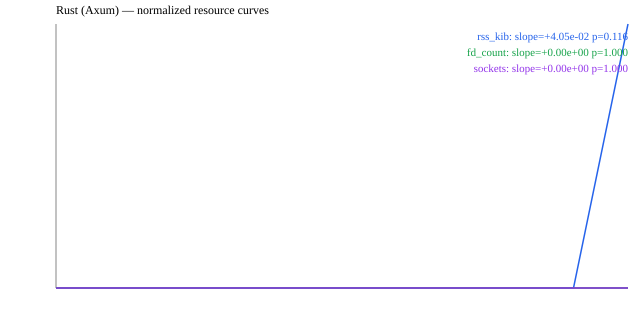
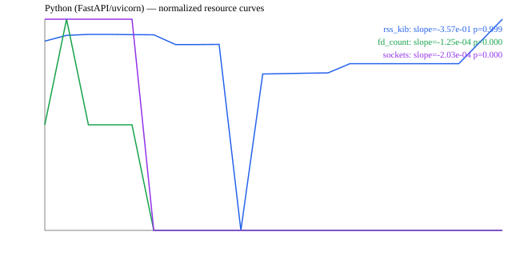

# Sprint 3 — Resource Stability (dual-stack)

Slope = per 1000 requests; p is a normal approximation on Student-t (df = n-2). **p > 0.05 → slope not statistically significant (no leak).** Note: `tokio::runtime::metrics` was not included — it requires the `tokio_unstable` cfg that shipped binaries do not build with.
## Rust (Axum)

Load: 10k sequential + 1k concurrent `GET /api/health` (samples every 500
requests). Metrics from the server PID: `/proc/<pid>/status` (RSS),
`/proc/<pid>/fd` (FD count), `ss` (established sockets to :7421).

| Metric | slope (per 1k req) | R² | t | p (two-sided) | Δ / 10k req | Verdict |
|---|---|---|---|---|---|---|
| rss_kib | +4.054e-02 | 0.1592 | +1.897 | 0.1157 | +0.405 | stable (within budget) |
| fd_count | +0.000e+00 | 0.0000 | +0.000 | 1.0000 | +0.000 | stable (within budget) |
| sockets | +0.000e+00 | 0.0000 | +0.000 | 1.0000 | +0.000 | stable (within budget) |

## Python (FastAPI/uvicorn)

Load: 10k sequential + 1k concurrent `GET /api/health` (samples every 500
requests). Metrics from the server PID: `/proc/<pid>/status` (RSS),
`/proc/<pid>/fd` (FD count), `ss` (established sockets to :7421).

| Metric | slope (per 1k req) | R² | t | p (two-sided) | Δ / 10k req | Verdict |
|---|---|---|---|---|---|---|
| rss_kib | -3.573e-01 | 0.0234 | -0.675 | 0.9993 | -3.573 | stable (within budget) |
| fd_count | -1.246e-04 | 0.4886 | -4.260 | 0.0000 | -0.001 | stable (within budget) |
| sockets | -2.035e-04 | 0.5373 | -4.698 | 0.0000 | -0.002 | stable (within budget) |

